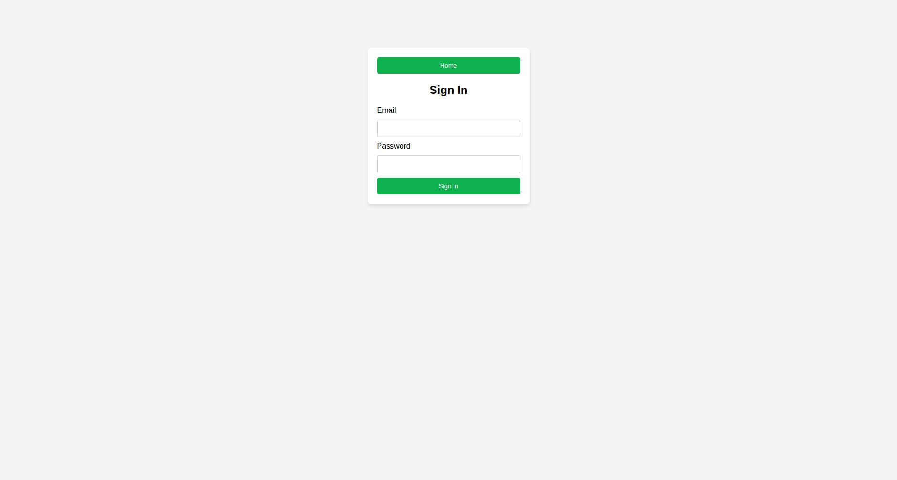
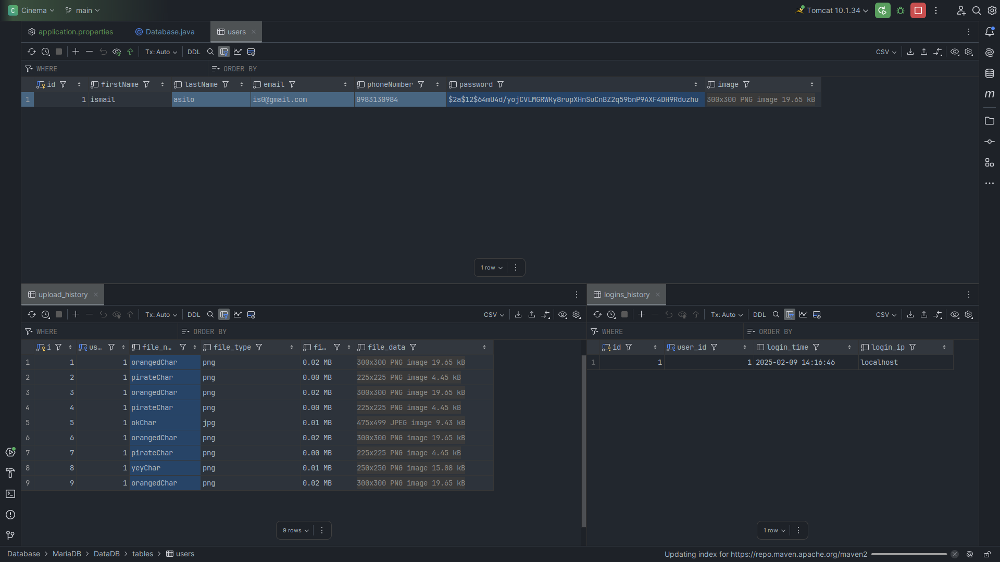

# First Web Application (FWA) - 42 Cursus

## Project Overview
FWA is a Java web application focusing on servlets, authentication, and user management using JSP and JDBC. It involves registration, authentication, session management, and file uploads.

## Technologies Used
- **Java (latest LTS version)**
- **GraalVM**
- **Maven**
- **Tomcat**
- **JDBC (JdbcTemplate)**
- **BCrypt (password encryption)**
- **JSP & Servlets**

## Key Features
- User registration & authentication with encrypted passwords.
- Authorization filter to protect user profile pages.
- JSP-based profile page displaying user details and login history.
- Image upload functionality with unique file naming.

## Deployment Instructions
1. **Clone the repository:**
   ```sh
   git clone https://github.com/ismailassil/fwa.git
   ```
2. **Set up the database:**
   - Configure `application.properties`.
   - Run `schema.sql`.
3. **Build and deploy:**
   ```sh
   mvn clean package
   ```
   - Deploy `target/cinema.war` to Tomcat’s `webapps/`.
   - Access the app at `http://localhost:8080/cinema`.

**May the Force be with you!** 🚀






